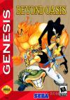

[光之继承者](https://pewae.com/gaan/aHR0cHM6Ly93d3cuZG91YmFuLmNvbS9nYW1lLzEwNzY0Mzk1Lw==)

原名：Beyond Oasis别名：雷神传说机种：MD厂商：世嘉类别：A-RPG发行年月：1994-12耗时：60

传说中的秘技1:选择进度画面,选中一个空进度.同时按下A和C键,进入音效测试画面(没试成功过)
传说中的秘技2:快速练级法,在通往火之神殿的路上,桥下有个火堆.不停往上面撞.当血只剩下一丝的时候召唤出水精灵把血加满.这样出去随便打一个敌人,就可以打出升级红心(没试成功过)
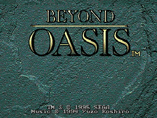
ARPG的代表作之一.虽然ARPG是俺最讨厌的类型.但是这个游戏玩得还不赖.其实这个游戏也算是一种积怨的爆发.当年的电软复刊以后的第一期,发行量算比较大的,但是接下来的两期都没有按时到,害得俺那叫一个朝思暮想啊,生怕又停刊了.而且95年的时候俺也还没偷着攒钱买MD,就只能靠看攻略过干瘾.看得最多的就是光之继承者和梦幻模拟战的.
这篇不是当年电软的攻略,比当年那份要详细的多,不过俺一直觉得这种带解谜因素的游戏看攻略玩就没意思了,所以不推荐.不过感兴趣的还是点~~这里（http://md.gamehome.tv/gl/md_3033.shtml）~~看看吧

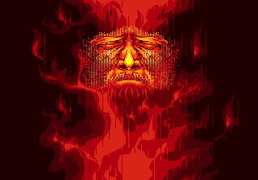
作曲是著名的古代佑三.不过俺滴感觉是他弄完光之继承者才出名的.玩游戏第一次看到在片头和片尾反复出现作曲的名字.也不知道是谁利用谁.反正这个游戏在当年是没有获得任何音乐方面的奖项.
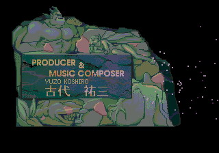
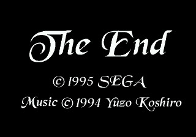
ARPG虽然也是RPG,但是光之继承者的故事是挺狗血的.说一个王子(默认名努尔)在~~偷东西~~冒险的时候,捡到一个金色的腕轮(权当是护臂吧),等他回到家乡的时候,发现被封印的恶魔出来闹妖了,于是我们勇敢的王子拿起小匕首,开始了牛逼哄哄的战斗…
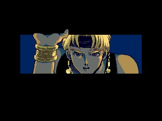
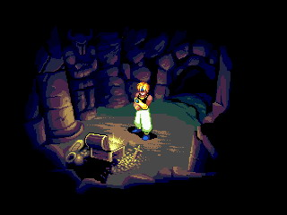
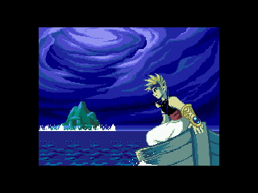
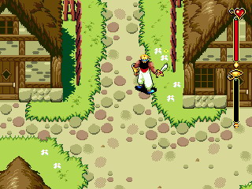
故事是围绕的金色腕轮展开的,游戏过程中通过收集道具,努尔会获得召唤精灵,自动回复法力等能力.
精灵一共4只,水精灵的作用是回复,灭火,停止瀑布,冰冻敌人,杀人,可以通过水渠,海水,喷泉(?),**史莱姆**召唤出来.
火精灵用来点火,赛跑,主动攻击敌人,基本上就是个战士.可以通过火把,喷火的机关,火墙,**炸弹余光**,燃烧的敌人,火焰怪等召唤出来.在手上能点火的武器不足的时候,是用来点火的好方法.
影精灵可以防止掉坑里,替死,用影子抓取物品,灵魂出窍(观察地形和踩机关).可以通过影子石,冰柱,镜子,**穿盔甲的军曹**召唤出来
木精灵最废.唯一有点用处的是咬破绿色的栅栏.至于用其来踩机关或者咬人,纯属鸡肋.只能通过绿色的那种小草召唤.
**所有的精灵可以都通过用腕轮照射其同属性的宝石召唤出来**
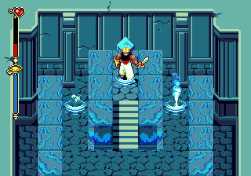
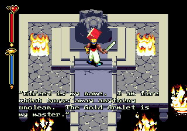
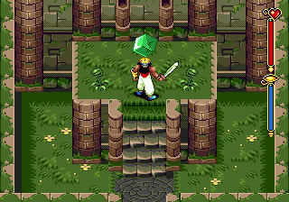

每次游戏开始的时候,都喜欢跑到西边海岸,晒上一打干鱼(HP75%回复)带上.很简单,只要逗引水里的鱼蹦出来咬你,然后挡着不让它往回蹦就行了.
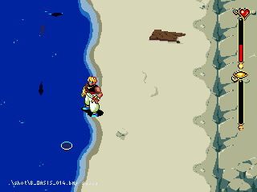
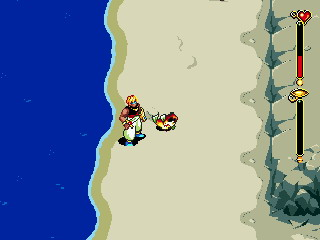
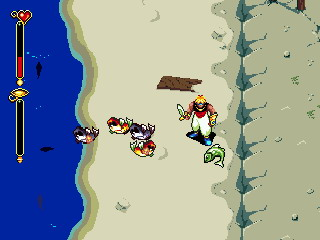
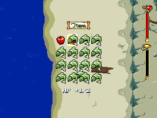

游戏中有5把无限次武器.
无限次火焰剑位置在僵尸森林单独的树下(也是最难打的一个)
拿的时候注意,最好在捡到了不召唤精灵的时候可以自动回复法力的项链之后再进,这样的话遇到史莱姆可以召唤水精灵出来加血.不然想打到底就比较难了,因为里面是不让用道具的.下来之前匕首的回旋斩(手柄一圈后B)和反身斩(前后前B)一定要使用熟练.当然,也有达人能够一级就闯100层的.如果前面能捡到无限次剑,后面也会轻松许多.

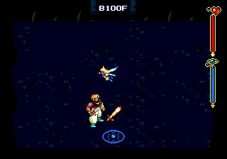
无限次爆炸弓位置在西海岸.用腕轮照图示的地方即可.跟火焰剑相反,在这里可以用物品但不能召唤精灵.所以要稍微容易一点.另外个人感觉在这升级比较容易.注意不要贪心.在最后的宝箱出来之前不要碰任何之前的宝箱,也不要让敌人打破.
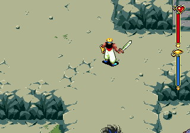
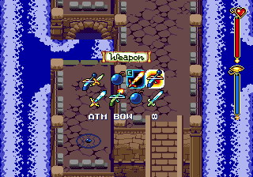
无限次火焰弓就比较容易了,在火之神殿附近有个火精灵竞技场,跑在1分10秒之内就能得到.另外在这里**还得跑个第二名**,有一块火晶石拿.
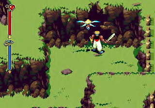
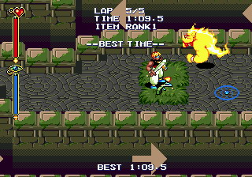
无限次超级炸弹.个人认为是全游戏最难的地方,完全靠伪3D的跳的技巧.最恶心的是,你怎么跳过去还得怎么跳回来.在刚招完影子精灵出来的地方,桥的下边有个宝箱,里面是一块影子晶石.在这个地方往下方跳,然后一直往左就是了.及其非常以及特别之难,建议带足葡萄并召唤影子.
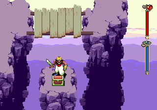
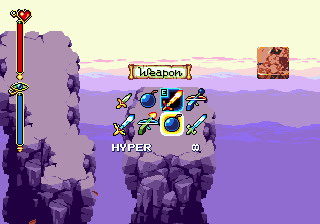
无限次金属弓.在东方魔宫附近有个地方,一个钉子被好多管子围住.用影子精灵才能进去.但是得到影子精灵以后很难立刻回到这里.而且这个东西攻击力也不高,挺鸡肋的.如果不是为了收集全武器,真没什么必要跑回来捡.要是换成无限次DATH就好了.
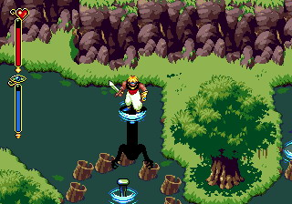
**传说中的无限次冰冻剑是不存在的!利用bug掉到绿精灵洞窟边上的100层,其实就是火焰剑的100层!!**

两个隐藏传送点:
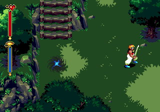
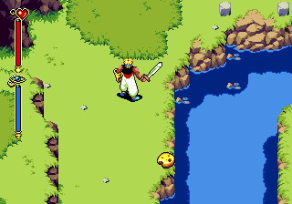

很牛的中boss和很面的最终boss
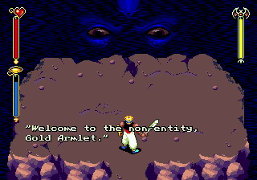
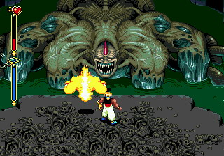

通关
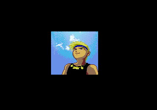
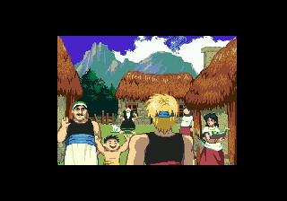
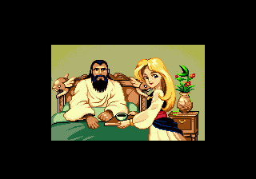
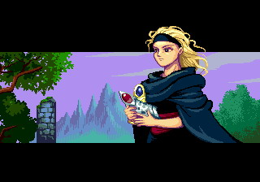
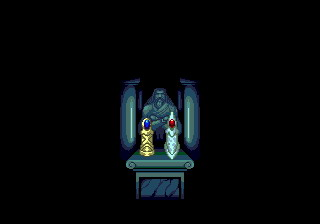
遗憾啊,转悠了4个小时也没找到差的那块水晶石
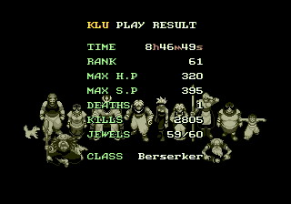