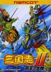

[三国志2：霸王的大陆](https://pewae.com/gaan/aHR0cHM6Ly93d3cuZG91YmFuLmNvbS9nYW1lLzEwNzUwNzAwLw==)

原名：三国志II 覇王の大陸机种：FC厂商：NAMCO类别：SLG发行年月：1992-06耗时：960

我一向不以游戏画面为重，即使是玩了30多年的红白机，百玩不厌的游戏也有好几个，霸王的大陆是其中累计游戏时长最长的那个。

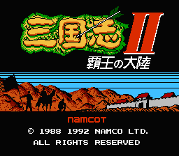

1995年的春天，死党宝宝和我已经不再满足于动作类游戏，我们有了更高的追求，开始玩文字卡。先是受电软的蛊惑，去买了一盘《赌神》。可赌神太难了，打不穿，刚好宝宝有个大我们三岁的表哥，给推荐了《霸王的大陆》，我们就带着赌神，去卖游戏卡的老板那里，花了10块钱手续费，换回了《霸王的大陆》（赌神比霸王的大陆贵）。
宝宝那时中午在他奶奶家吃饭，而他自己家跟他奶奶家住前后楼。吃饭快的话，我们溜到他自己家，每天中午大概能玩20分钟到半个小时的游戏。半个日文都不认识的我们，照着说明书，战战兢兢地开始了游戏之旅（怕他爸妈突然回来）。
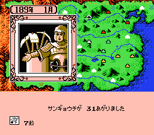
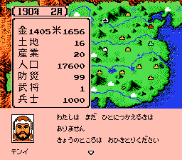

不光是不认识日文了，我好歹还读过少年版的《五虎将的故事》，宝宝关于三国则只看过几本小人书。不仅原著没看过，电视剧也还在后期剪辑中呢，所以凭第一印象当然要选有关张的刘备啊！刘备德99，好像是最高的哎！关羽武97，知84，会那么多技能，一看就是牛啊（后来才知道这个84有多么蛋疼）；张飞智力只有20，所有初期武将里排名倒数第四，不至于吧……
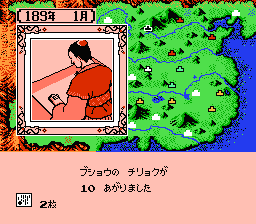

第一仗出去打董卓，没打过，张飞退回并州，刘张逃到荆州，因祸得福。第一次玩的时候印象最深的是两件事，第一是用雷薄宰了董卓，得了七星宝剑，觉得这个人物在三国演义里一定很牛，谁知道第一次读差点没找到这个人；第二是孙策那边一个长得很有意思的将领每个月都会来打，简直是送经验的，抓住以后才知道，这就是太史慈。从此不管玩哪一版三国，都对太史慈有着特殊的好感。宝宝宝其实不太喜欢玩这个游戏，暑假这卡就归我玩了。欲罢不能。一个假期里除了董卓和袁绍都被我翻了一版。这里不得不感谢宝宝的表哥。当时的游戏卡用一块CR2302纽扣电池来存记录，盗版卡质量不好，辛辛苦苦打的游戏，一不小心就会掉记录。宝宝的表哥动用了黑科技，把电池摘了，焊上一个大电容，手艺超棒，再没了掉记录的烦恼。
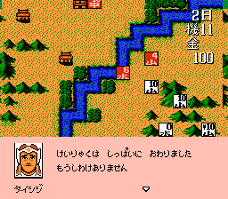

从95年到96年，只要是假期，差不多就在打《霸王的大陆》，或者另一盘文字卡《封神榜》。
甚至初升高考试前两天放大假，“放松心情”，我都打了好几个小时的霸王的大陆。
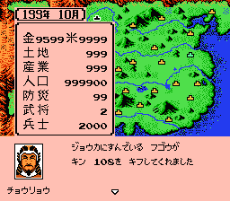
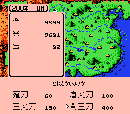

好景不长，这盘卡在96年初升高考试后借给黑哥没几天，就被他弄丢了。黑哥赔了我100块钱，我完全可以拿钱去买盘新卡，可斟酌再三，我还是跑去又买了一盘一模一样的《霸王的大陆》回来。
这个游戏并不是出自以战略游戏出名的光荣，而是来自另一大厂南梦宫。跟光荣的三国相比，霸王的大陆简化了内政，强化了武将的作用。尤其是智将，在三国11出来以前，都没霸王的大陆这样使计策使得这么爽的。
本作在国内拥趸非常多，以至于网络时代，通过反编译逆推，大能们几乎把所有的公式都给研究透了。什么忠诚度低的武将先投降再笼络回来，能省一大笔提高忠诚度的钱啊，什么全游戏智力最低的妫览单挑招人有奇效啊，什么武力90以上站树中间以一敌千啊……各种骚操作，都是以前真机时代不敢想的。
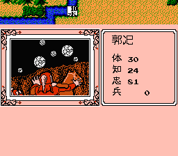
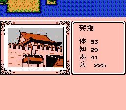

其实这个游戏做得一点儿也不严谨。随便一个小卒，只要肯升级肯读书，都可以独当一面，而初期只要把两个武力90以上的武将用SL大法读书读到85以上，就可以横扫天下了。但最喜欢用的还是周瑜。首先是智力高会劫火，升级嗖嗖地，其次是武力有成长性，能涨到91跟一流武将没差别，最重要的是跟194年才出来的诸葛比，192年就出现太有优势了，不费吹灰之力就可以统一全国。最讨厌的则是程昱，总是在兖州占着茅坑不拉屎，挡着不能招后面的徐晃和郭嘉。很久很久以后，才知道那种需要多请的武将完全可以用SL招，根本不用费那么多行动力令牌。
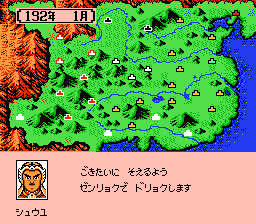
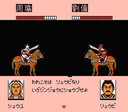

打得多了，逐渐形成了自己的套路——选孙策——离间吕布——吕布太史慈读书——向上打到幽州，找赵云——晃悠两年等周瑜——统一全国。
选孙策的原因是他是能打死刘备和曹操得特殊装备的君主里最厉害的一个。
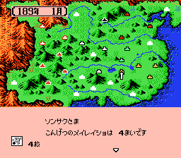
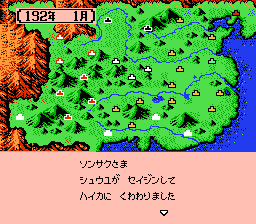
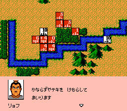

对于我来说，这样的游戏对加强对原著的理解是非常有好处的。如果不是游戏，三国原著我可能只会读一遍；如果不是游戏，谁还能记得阿会喃、韦康、妫览这样活不过一回的小角色？说起阿会喃，那可是这个游戏里的一个传说。其实是游戏代码的不严谨会造成数据的溢出，阿会喃在武将名单里的头一个，所以一旦数据溢出，第一个产生变异的就是他。伊籍第二，韦康第三，于是也很容易变身。
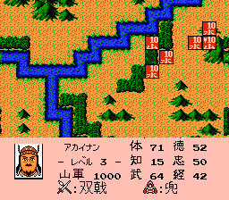

刚开始玩的时候，为了爽，往往先选双打，1P选自己想用的势力，2P则选董卓。2P主动对1P宣战，然后把一堆饼材摆成十字给1P练级……现在有了模拟器，技术也提高了很多，不屑于自己打自己，但对于每个智力低下且武力不高的敌人仍旧视若珍宝。
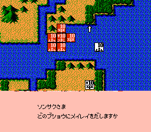
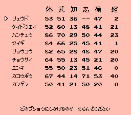

如今打霸王的大陆，是很闲适的玩法：除杀曹刘得特殊装备以外，不让另几家多次继承。马腾等到197年马休出来之后再杀。到210年曹睿、诸葛瞻、诸葛恪出生之后再统一全国，理想状态下只杀董卓、刘璋、袁绍、马腾、曹操、刘备、于禁、杨阜这六个。有时想想，为了等那几个饼材，我的吕布、太史慈、周瑜都会死。真不值。
游戏后期只留刘备和曹操的后继势力，堆一大堆废柴给他们，等着他们出兵来打。真机时代还需要隔三差五用投降的办法给他们送钱，PC模拟器干脆直接把两家的钱粮锁上，尽管来打好了。
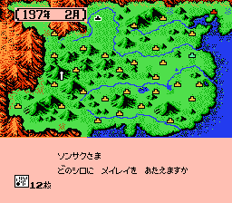

说到后期。策略类的三国游戏都是开头好玩，后期无聊本作也不例外。霸王的大陆有个高级结局画面的想头儿，所以后期会拼命发展内政，这也是为啥变身的阿会喃那么吃香，255的智力啊！其实通关画面也就那么回事儿，这么多年了我都没体会出差别来。
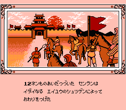
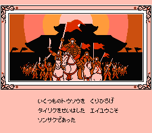
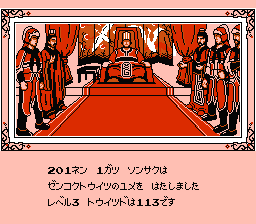
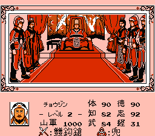
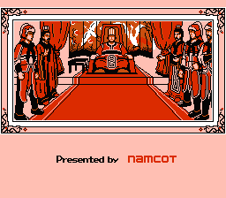

当然更少见的是GAMEOVER的画面，真的很难死。以前在真机时代只死过一次，还是跟3P双打。双方约定各占一半的城市，然后不带兵只用武将互殴。他手下有吕关张马黄魏典，我的孙策太史慈甘宁。最后宋宪爆发，连砍对方吕布庞德，最终灯枯油尽弹尽粮绝……
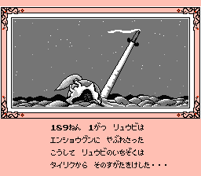