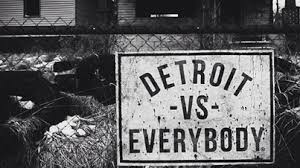

NBA的2015-2016赛季常规赛今天结束了。

我的球队时隔七年之后重回季后赛。

感谢马裤，你继承了汽车人混不吝的传统。
感谢拖把，你成为阵容最后的重要拼图。
感谢贝恩斯，你保证了内线的硬度。
感谢布洛克，你在某几场比赛挽救了这个赛季。

感谢教皇，虽然你的投篮让我心惊胆颤。
感谢雷吉，虽然你太过个人英雄主义。
感谢庄萌，虽然你还不够强硬。
感谢斯坦利，虽然你脑子还没开光。
感谢大范，虽然你有时过于死板。

感谢伊娃和建宁，我们永远是一家。

不用早早研究选秀的感觉，真好。
跟宿敌血拼的感觉，真好。

不奢望黑八，不苛求胜场，只求打出汽车城的血性来。相信再过一个赛季，我们会登上更高的舞台。

P.S：不必奇怪我写这种东西，20年来我一直是活塞的队密。以及，曾经我是艾迪琼斯的球迷。