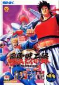

[风云默示录](https://pewae.com/gaan/aHR0cHM6Ly93d3cuZG91YmFuLmNvbS9nYW1lLzI2Mzc1NTYy)

原名：Savage Reign机种：ARC厂商：SNK类别：FTG发行年月：1995-04耗时：4

在我经常流连街厅的上世纪90年代中后期，格斗游戏占据了“正经”游戏厅的半壁江山。格斗游戏实在不是我擅长的类型，在99年上大学能用模拟器天天跟室友切磋拳皇以前，我只能在一款格斗游戏上打到第五关。
没错，就是《风云默示录》。
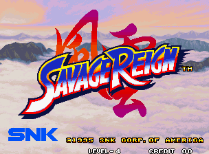

1996年8月的15或者16日，高中分班报到。男班主任老师用了大概20分钟，布置完军训的准备事项后就直接给放学了。于是我就像来到陌生环境的野狗一样，开始在学校周围转圈~~撒尿~~踩点。书报亭、音像店、租书房、台球室、电游厅、电脑房什么的，自然要标记一番。马路（201国道的市区部分）对面有家电游厅，离学校虽然不太远，但位置有点尴尬，离平常吃喝玩乐的市场和书店音像一条街有些远，所以里面的人并不是很多。
《风云默示录》这个游戏是这个游戏厅里唯一一个我之前没见过的游戏，所以好奇心驱动之下就投了币。左手边的大热游戏《天外魔境》围了太多人。所以自然选了2P，2P默认选人就是拿斧头的埃格。然后懵懂的我，靠着换线和扔斧头这两招，打到了第三关。这令我激动不已，我打《街霸2》、[《富士山》](https://pewae.com/2009/11/yesterday-reproduction-of-mount-fuji.html)和《豪血寺一族》的最好成绩也就只有三关，其余的格斗游戏甚至到不了第三关。
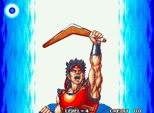

军训回来，就从电软上翻出了出招表。开学后每天午休时间，就跑到这个街厅，每天花费2个币对这个游戏展开研习。一周之后，只要不在第四关遇上马面，我就能把成绩稳定在第五关。第二周开始，也没什么突破，我就没再去了。
后来那个电游厅没活过1997年的春天，我也没在第二个街厅见过这个游戏。
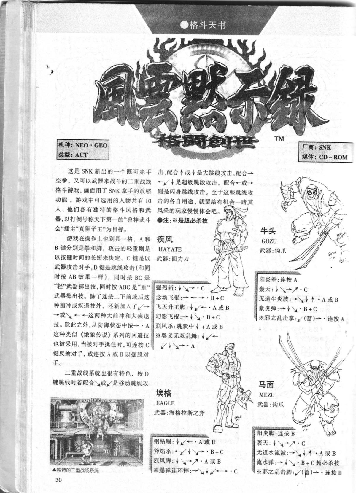
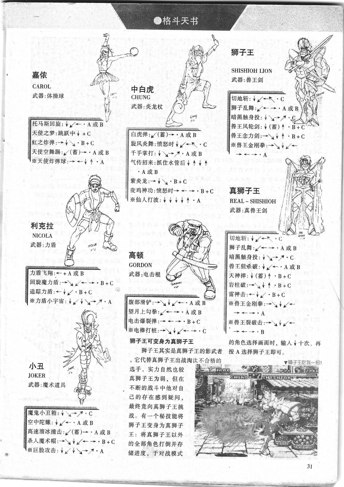

能打得远，得益于本作独特的系统——跟恶狼系列一样的换线+独有的武器投掷系统[[1]](https://pewae.com/2024/10/savage-reign.html#inner_anchor_1)。另外就是本作的节奏判定特别合我胃口，在街霸里无论如何也掌握不好的摔人，本作那是手拿把掐，成功率90%以上。
其实我只会一招半：远程扔斧头牵制，然后换线或者等对手换线的时候一个大摔。到后面AI的换线手段比我反应要快，自然也就不灵了。SNK的游戏，能换线的一定伴随着缩放。其实我是不太喜欢这种忽大忽小的感觉的，所谓的紧迫感一点儿没有，眼睛倒是难受。
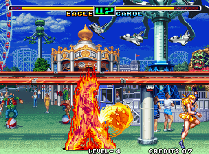

游戏有10个可选角色。这次我没选女的，而是坚持了自己的初心，选了斧头帮的埃格。埃格也是游戏的2号男主，类似街霸里的肯。埃格的三个绝招是升龙、突进和投掷大招，超必是个指令投。
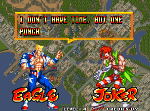
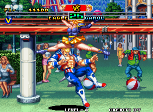
游戏好玩的地方倒也不是这些必杀超必杀，而是换线后配合方向和按键的换线攻防。另外还有个很好用的共同特殊技——在对方发射投射武器的时候，抓准时机按C，可以将武器反弹回去。可惜二代舍本逐末，舍弃了双线系统，改成二人组队模式，一下子就不想玩了。也许是因为这种拳脚+武器的设定，跟《龙虎》、《恶狼》、《侍魂》、《世界英雄》以及后来的《月华剑士》都有冲突，不上不下的，这个系列也就二世而终了。
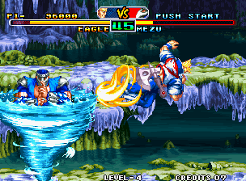
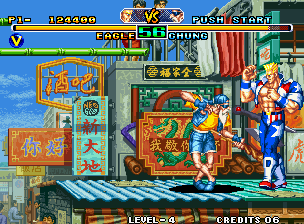

可能是因为用模拟器有SL大法并且没调难度的原因吧，这次重温也没觉得太难。轻描淡写通关了。最后的BOSS真狮子王也就是出招比别人快一些，招式威力大一些，但收招的破绽还是很大的，不贪功的话不难打。
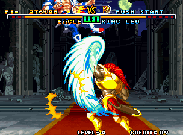
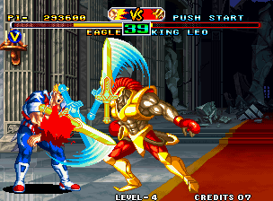

通关后的小对话解释了为什么埃格是男二——他怀疑最终BOSS真狮子王是他哥，但通关后他哥也没认他。
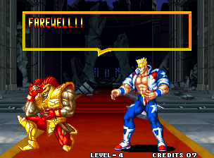
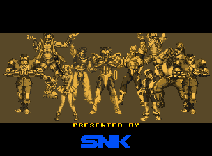
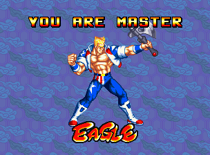

---

- [(1)](https://pewae.com/2024/10/savage-reign.html#inner_ref_1)：不像《侍魂》和《天外魔境》那样还需要把武器拾回来，而是每个人的武器都能飞去来。