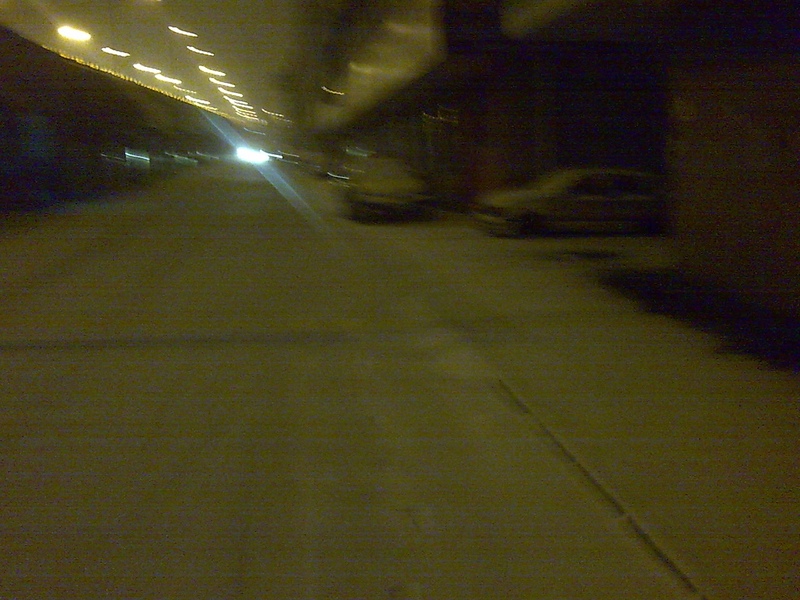
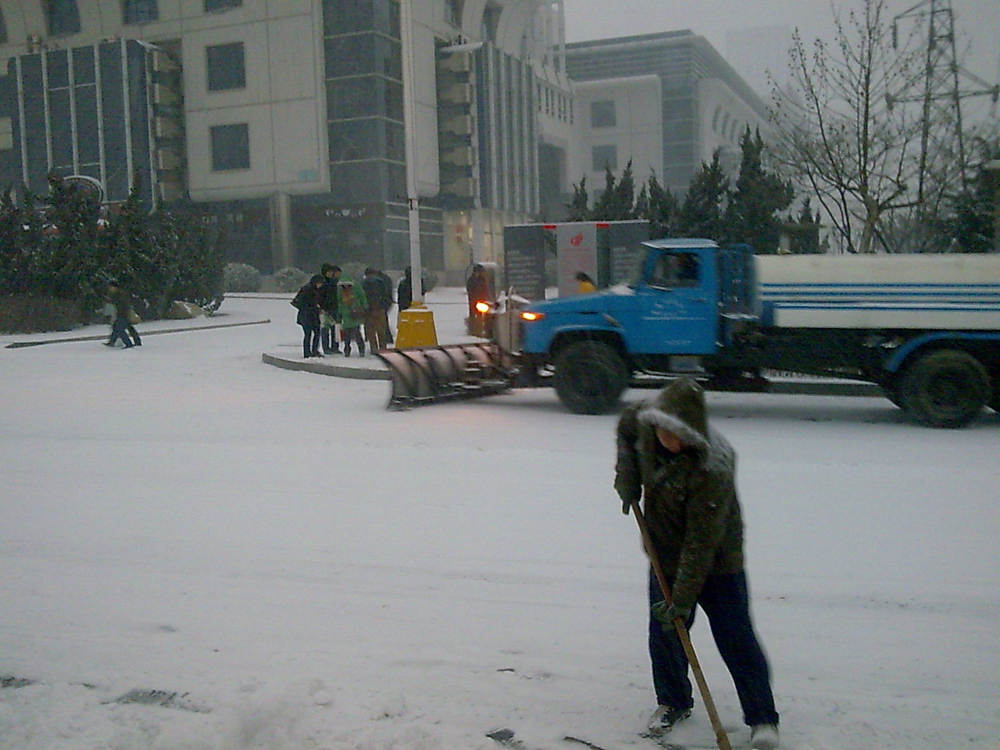
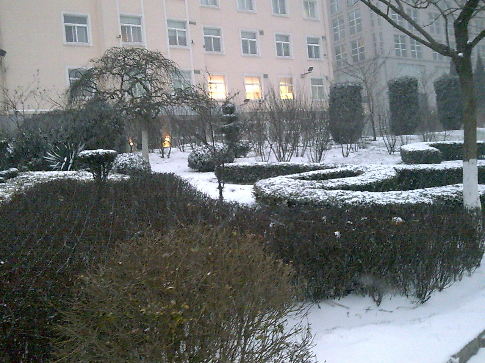
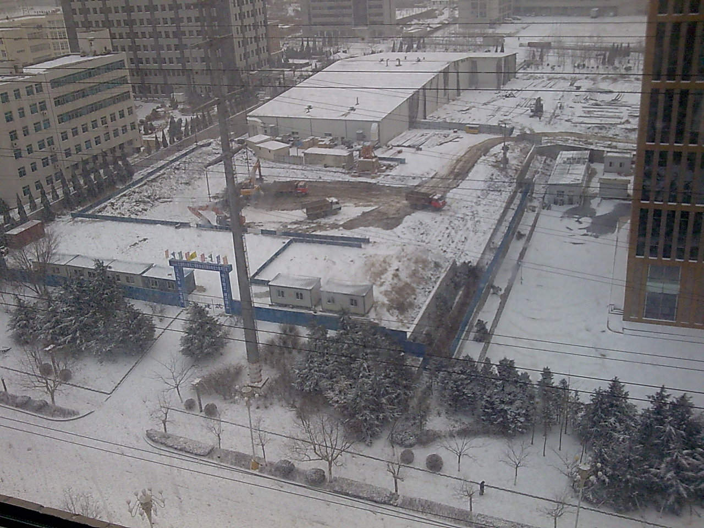
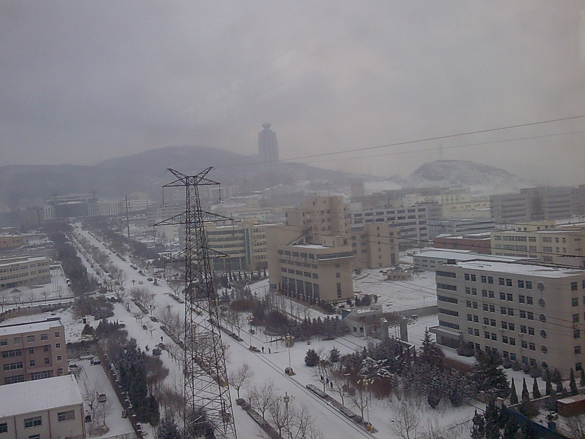
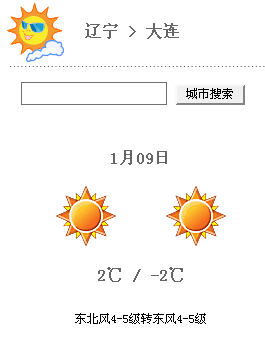
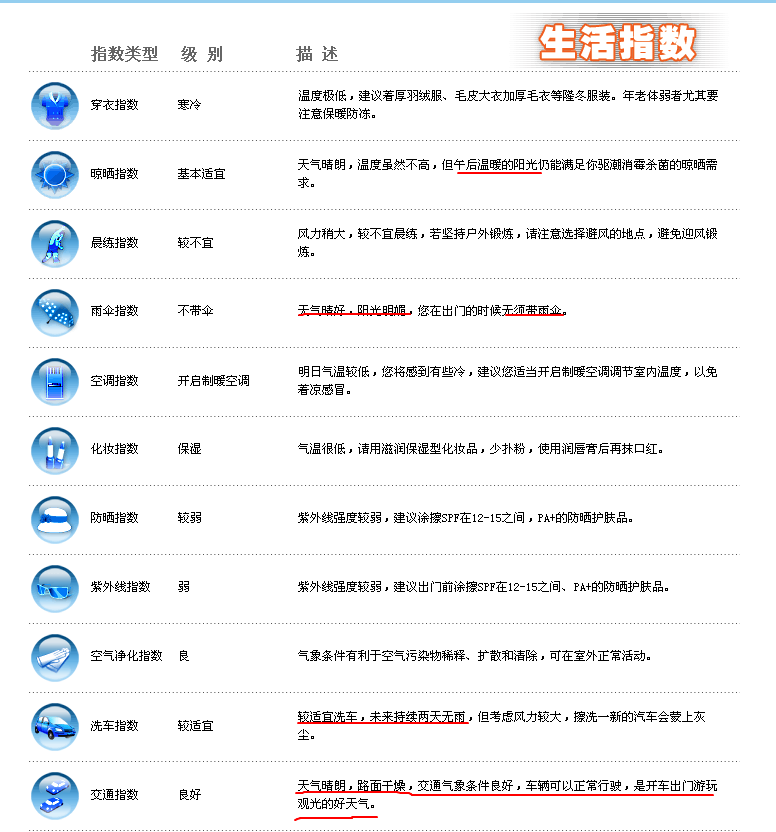

今早起来,闻着窗外味道不对;惺忪中发现下雪了.
被迫取消了洗头,蹲大号和刮胡子的计划,急匆匆奔出家门.
虽然身在北方,但是大连下雪的日子其实并不多.
所以每次下雪,都少不了拿手机相机胡拍乱拍的银.
俺也是:mrgreen:

同事Wei抱怨说他昨天查的天气预报不准确,俺就不禁想起了当年的电软上的一段话:
*继《赌神》刊出后，《game集中营》多次刊登消息：《吞食天地》中文版将于春节、五一发卖，但音讯皆无。一玩友来信曰：“**只有气象台才说谎，集中营焉有此资格。**”诸编皆大窘*
就到他看天气预报的网站看了一眼.
结果,差点笑出声.请看截图:

对比一下真实情况:

唉,可怜Wei50多岁的人了,竟然还相信天气预报这种东东.