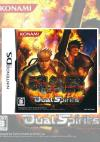

[魂斗罗4](https://pewae.com/gaan/aHR0cHM6Ly93d3cuZG91YmFuLmNvbS9nYW1lLzExNTM4NDU2)

原名：魂斗羅デュアルスピリッツ别名：Contra 4 / 魂斗羅 Dual Spirits机种：NDS厂商：科乐美类别：ACT发行年月：2007-11耗时：5

这游戏在本系列里当然是新的不过也有十几年的历史了。其实我不过是心血来潮想测试一下现在NDS模拟器的效果而已。选这个游戏也不过是想了结一下心结而已。
这游戏对我来说忒难了。真机上调成Easy模式，也只能过第一关。
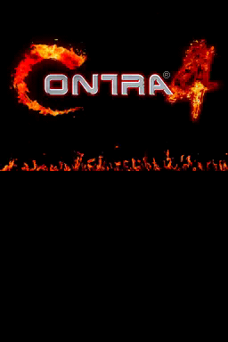

能打通自然主要是靠SL大法。但仍旧有些BOSS速度实在太快没掌握好S的时机，死了三四条命。本作Normal模式吃到同样的枪，火力能增强一次。也正因为如此，一旦挂掉就会非常难受。
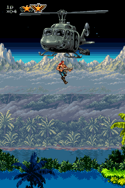
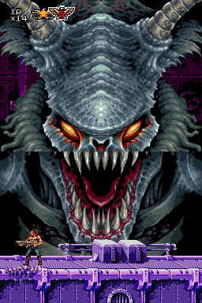
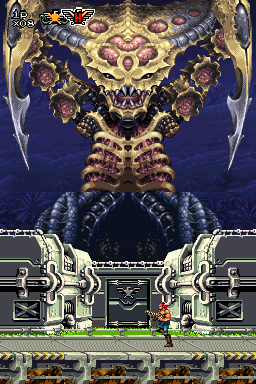

用S霰弹枪纯数小时候的习惯使然。可能是主机性能提升的原因，S枪本作失去了正面方向的连射效果，其实并不好用，好用的是M豆。好在L键能切换武器，打小兵和打BOSS分别用不同的武器，还不错的设计。
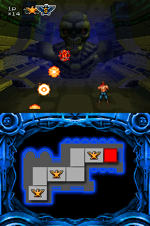
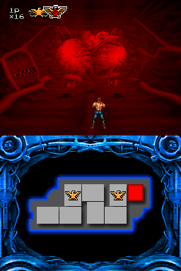
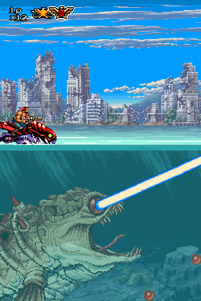
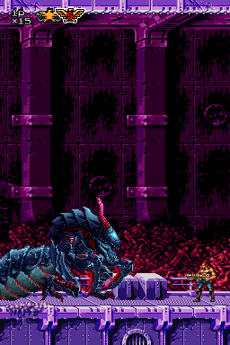
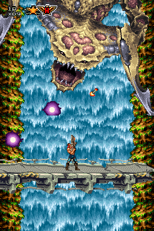

除了敌人动作的迅捷和需要背板的地形杀以外，本作莫名增加的难度来自对NDS上下屏的利用。上下屏之间的物理间隔让子弹的轨迹和速度变得难以捉摸。而且可能是岁数大了，顾头不顾腚，往往看不见跟自己不在同一屏的敌人和子弹，因为这个读了无数的档。
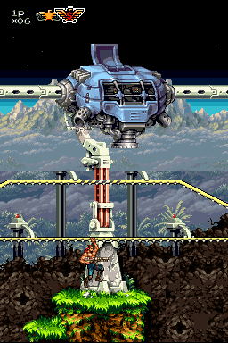

另外一个难点就来自“爬”这个动作。希魔复活式的扔爪子，蝙蝠侠式的爬墙，洛克人式的爬藤蔓以及怪盗飞天德那种抓墙，都令人恼火。尤其有一关打BOSS前要在一个火箭上跳来跳去，感觉就不是在玩魂斗罗。
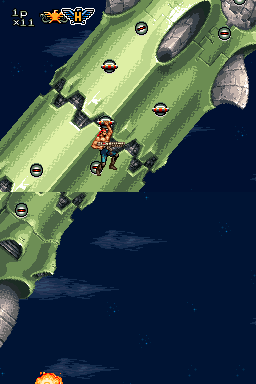

关卡设计主打一个怀旧风，一代的12348关都能找到影子。BOSS们几乎都不止一个形态，主打一个血长，有种干打不死的感觉。除了一个大跳蚤也没有什么特别有趣的BOSS。
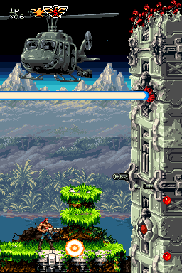
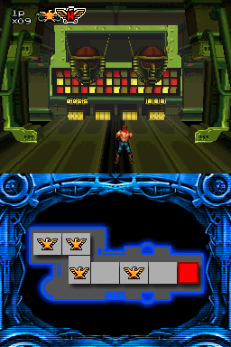
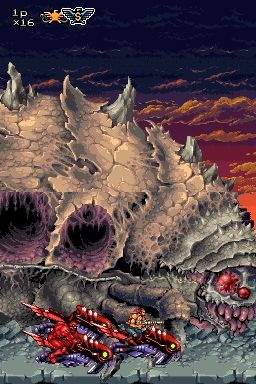

最终BOSS攻击方式不太丰富，但特别耐打。
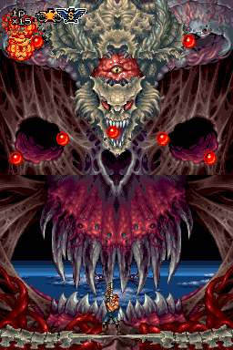

通关！
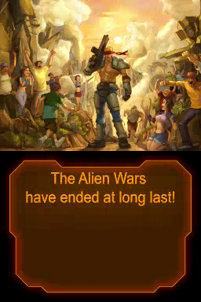

通关以后能解锁一个挑战模式，挑战N次以后能出现魂斗罗一代和二代，以及一些历史角色什么的。另外好像Hard模式会比Normal多出一关来，但这些对我来说都是浮云，没什么兴趣。
反正这游戏虽然很难，但却完全谈不上爽快，算不上优质的硬核游戏，强烈不推荐！