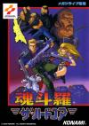

[魂斗罗：铁血军团](https://pewae.com/gaan/aHR0cHM6Ly93d3cuZG91YmFuLmNvbS9nYW1lLzIxOTgwNDY0)

原名：魂斗羅ザ・ハードコア别名：魂斗罗：铁血兵团机种：MD厂商：科乐美类别：STG发行年月：1994-09耗时：8

这个专题写了15年。“魂斗罗”这三个字在评论里被提及25次。现在，拜悠长的假期所赐，终于到这个系列了。
咦，怎么还有个子标题？
这就对咯，红白机的三款魂斗罗，在我阿尔茨海默之前都是不会写的。
因为拿枪突突这种快节奏、流行度高到烂大街的游戏实在不是我的style。小时候玩，那是物资匮乏没办法。
好吧，主要是因为烂大街。
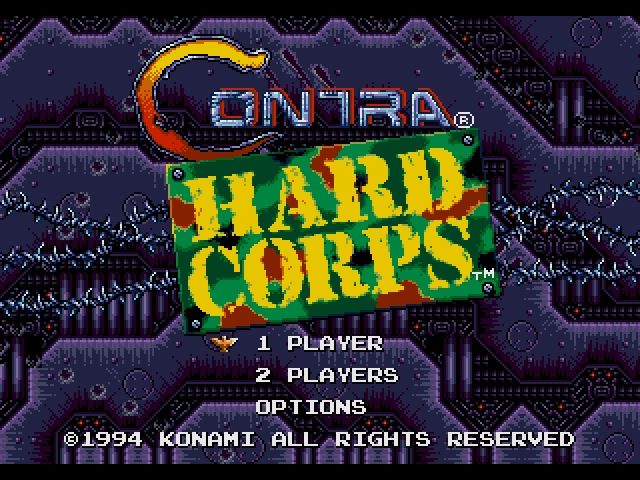

借机会先掰斥掰斥魂斗罗的早期谱系：
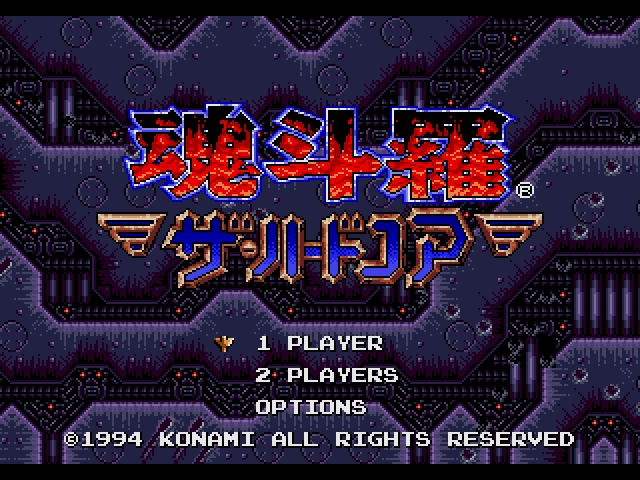
中国的70后到95前所熟知的红白机一代二代都是街机移植游戏，正规名字是魂斗罗和超级魂斗罗，无争议。
1990年的时候我家附近的街厅有过一款魂斗罗，那时候我也分不清楚是一代还是二代。因为太难，机台上都落灰了也没人碰，半年左右被老板换掉了。

中国人民嘴里的红白机代表魂斗罗一代，在日本的评价并不高。从销量看甚至是个扑街游戏——魂斗罗日本销量不足100万份，根本没资格进榜。也就是75名开外。
魂斗罗一的创意其实非常山寨——海报上两个主角比尔和兰斯赤裸裸地抄袭约翰（魔鬼司令）跟兰博。剧情里的外星人也是跟风靡全球的《异形》系列抄的。
FC魂斗罗发售于神仙打架的1988年。FF2，DQ3，科纳米世界这等现象级作品都是88年面世的，所以魂斗罗当年好像只排第九。Fami通评分只有27/40，这个评分的意思就是中规中矩。
让日本人来评红白机最佳游戏，超级玛丽大概率还是第一，但第二第三就不好说了，DQ4、马里奥3、塞尔达、DQ3、FF3、俄罗斯方块和打鸭子（不要笑！）似乎都有资格来参一腿。跟日本人说红白机游戏的代表是马里奥和魂斗罗，就好像日本人跟你说香港电影的代表是成龙和成奎安……而喜欢快节奏游戏的美国人民却普遍喜欢魂斗罗，评价大约是前十守门员到15的样子。
这个游戏在中国普及的原因大家都知道——在被大量盗版的游戏当中，操作性和音乐最好，并且能双打。所以比较的时候对手很重要。老四强没一个是白金级游戏。

1991年，GB砖头机上出了一款就叫【魂斗罗】的游戏，英文名《Operation C》。国内为了做区分，一般叫它做魂斗罗GB。这部作品的故事是延续了红白机上一代和二代的。两次战胜外星人之后，~~施瓦辛格和史泰龙~~比尔和兰斯又要去干妄图复活外星人的邪恶势力。
这个游戏流行度就更差了。GB时代在真机上玩过，使用科纳米秘技能调9条命。印象不深，最后一关过不去。
不知什么原因，科纳米并未把这部作品算在正传系列里。

1992年，超任上发行了《魂斗罗精神》。其美版名为《魂斗罗3——异形之战》。这才是正儿八经的魂斗罗三代。
同年，行将入土的红白机上又有了一款《魂斗罗力量（contra force）》。因为之前魂斗罗N代都被用乱了，所以这部科纳米出品的正宗作品竟然被国内盗版商翻译成魂斗罗6。这是款比较好玩的游戏，可以任意切换4名角色操控，在红白机游戏里还挺少见的。因为这个游戏只发行了美版，所以科纳米仍旧只把它定义成外传。
敲黑板，红白机上只有三部魂斗罗：魂斗罗一代、魂斗罗二代（超级魂斗罗）和魂斗罗力量，其余均为张冠李戴和移花接木。

在1994年，今天的主角终于登场了。这部作品在很长的一段时间里被称为“魂斗罗4”，更是有“最强魂斗罗”的美名。
然而这个头衔在2008年被科纳米亲手剥夺了，那一年他们在NDS上推出了名为《魂斗罗4》的游戏。
理由大概是这部作品的主角并不是比尔和兰斯。顺便说一嘴，在2002年PS2上的《真魂斗罗》的故事里，比尔把兰斯杀了。
于是，“最强魂斗罗”不入魂斗罗正传……

书归正传。
跟名字里带的“铁血”二字一样，MD版的魂斗罗跟系列风格一致，是个很硬核的游戏。我第一次接触这个游戏是在1998年，那已经是MD的晚晚期，世嘉卡非文字类游戏加10块钱随便换。我去电玩店打算用一盘非常糟烂的蜘蛛侠与X战警换个好点的游戏回来。刚好电玩店BOSS在打铁血军团的第四关。我在旁边看了个目瞪口呆，这游戏对我来说太难了。
打过一关以后，老板神清气爽地接待了我。问：“刚才我玩这个游戏想不想换？”我摇摇头，太难了。幸亏没换。老板玩的是美版，没有调枪秘技的，凭真实实力这游戏我过不去第三关。
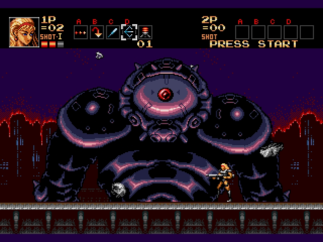

在不咸不淡地打了三代外星人之后，科纳米走了个重要人物，叫前川正人，此君三十而立跑出去创业，搞了个工作室叫TREASURE，挖走了好几个科纳米的核心程序员。1993年TREASEUR在世嘉MD上出了两部爆款动作射击游戏《异形战士》和《[火枪英雄](https://pewae.com/2009/01/gunstar-heroes.html)》。这可大大刺激了科纳米的神经，一方面跟TREASURE打官司投诉侵权，另一方面则悄悄偷取TREASURE的好创意回来自己用。
所以铁血兵团玩起来跟火枪英雄神似。滑铲的动作肯定是科纳米这边抄的，巨多的大型化敌人最初是谁的创意真不一定。
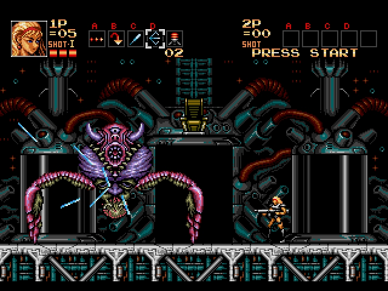

音乐本是科纳米的强项。这部作品的音乐节奏和旋律上没什么问题，典型的重金属混编。问题是某些关卡的配乐在压缩的时候出了问题，显得特别粗砺。印象比较深刻的曲子是第二关小BOSS的音乐，紧张而强烈。最后一关的音乐是恶魔城主题曲的改编，也不知当时想做什么暗示，难不成除了外星人还要跟吸血鬼扯到一起？
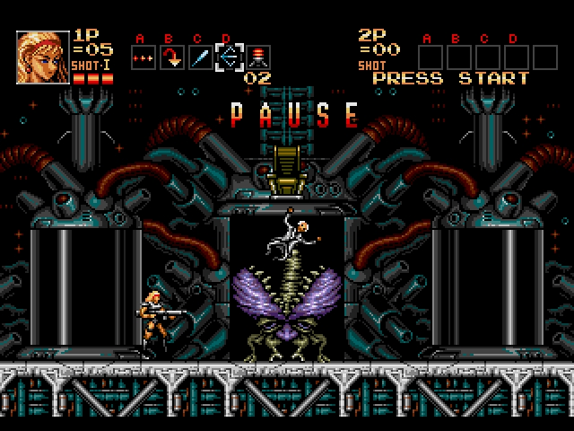

作为一个边跑边射类型的游戏，有四个角色可以选殊为难得。男主角照例一切平均，狼人体格大蹦得高火力猛，机器人身材小带二段跳，女主角的武器带跟踪。
照例有女的选女的。
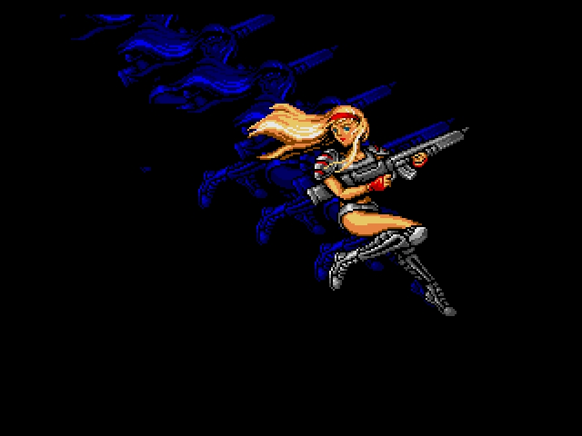

这部作品的普通杂兵其实没留下如何深刻的印象。劲都用在打大型载具和BOSS上了。BOSS的设定上很多跟火枪英雄极其类似，有种抄袭得很具体的感觉。
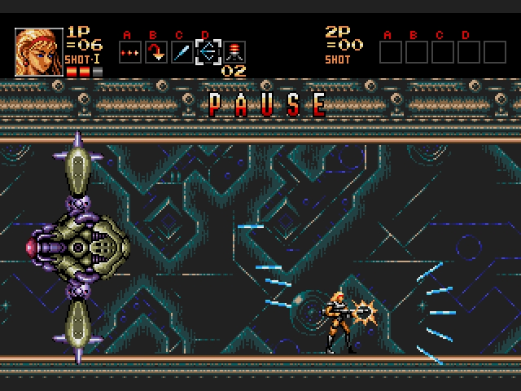
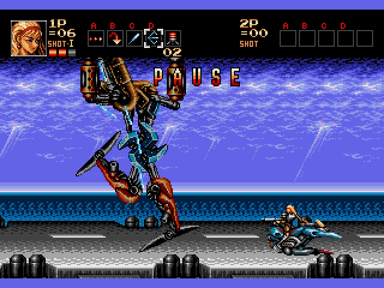

除了多主角，为了让玩家多玩几遍，这个动作射击游戏竟然也玩起了多路线多重结局的把戏。2*2种分支路线共有4个结局。还有个第三关半路逃跑的隐藏Bad Ending。
其实四个结局里有三个要么同归于尽要么被外星人统治，都不算太好。唯有一个战胜敌人且逃出生天深藏功与名的算是理想结局。
但选择这个分支路线，就意味着放弃了整个游戏最为惊艳的用2D模拟3D的公路追逐战。
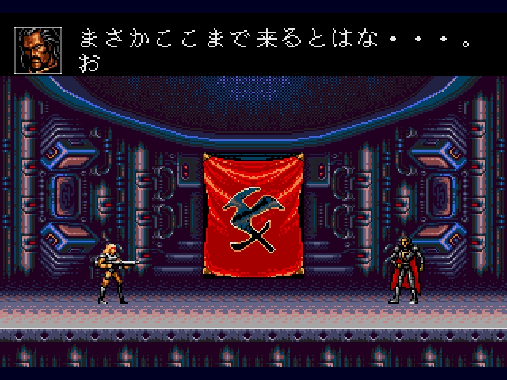

从这一代开始，魂斗罗终于有血条了，不再是一碰就死。这也就意味着我这种手残党可以锁血了！咩哈哈哈。
死命的时候，当时手持的武器就会消失。但是日版有个随时把四种枪补满的秘技：暂停上下上下A上下上下B上下上下C。
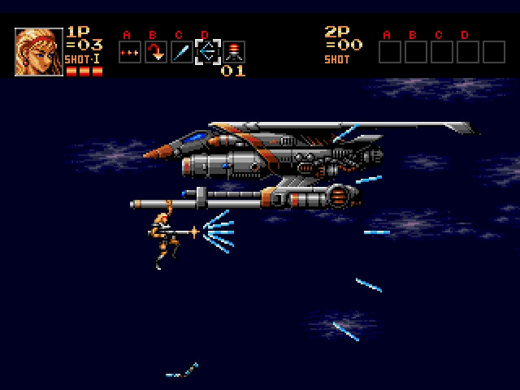

铁血兵团从SFC继承过来一个功能，是可以切换打枪的时候能否移动的设定。我觉得这个功能屁用没有净耽误事。跳起来不能放枪的魂斗罗还叫魂斗罗嘛！
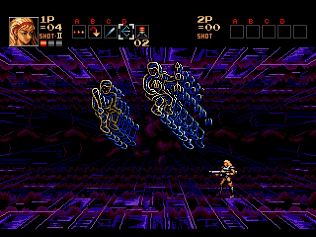

几个路线分支无非是先打BOSS还是先打异形的切换。
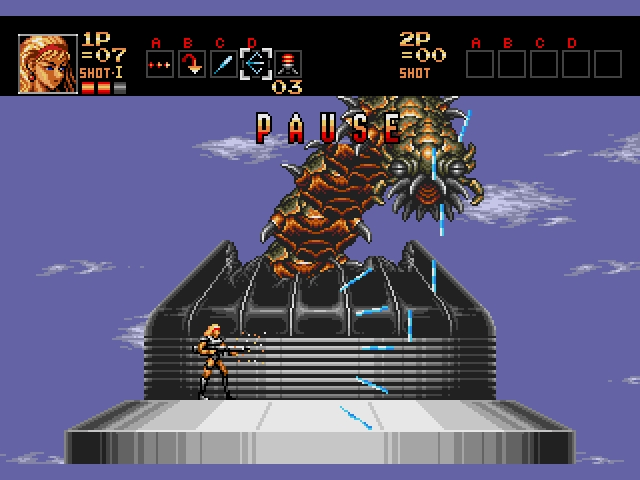
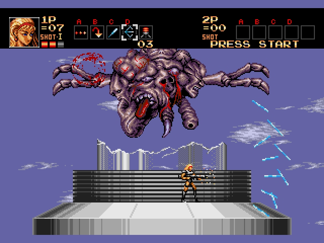

最好的结局也就那么回事儿。反正我是不会再打第二遍了。
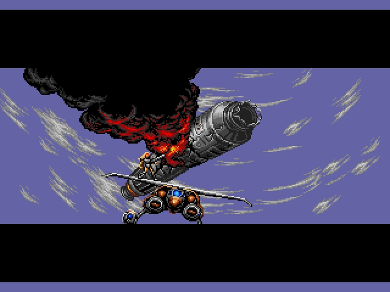
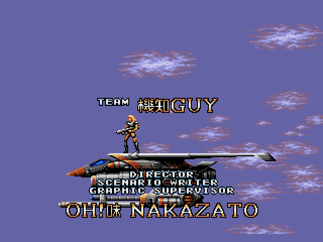
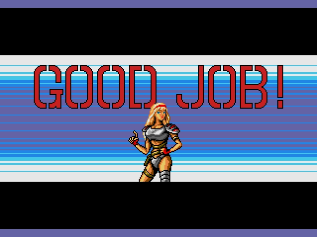