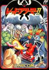

[魔界村外传：红魔冒险](https://pewae.com/gaan/aHR0cHM6Ly93d3cuZG91YmFuLmNvbS9nYW1lLzI2OTQ5NzEzLw==)

原名：Gargoyle's Quest II: The Demon Darkness别名：魔界村外传机种：GB厂商：卡普空类别：ACT发行年月：1993-04耗时：6

这款游戏的名字挺有趣，英文版直译是“石像鬼历险记”，日文版则是“红色阿利姆”。不管石像鬼还是阿利姆，指的都是卡普空著名变态难的游戏“大魔界村”里那个难缠的反派FireBrand（日版レッドアリーマー）。这也是中文版直接用日版副标题的原因。所谓的“外传”也是有剧情支持的：在魔界村神官们的攻击下，魔界内部产生了内讧，新王把老王关起来了，对僵尸吸血鬼等种族实施种族灭绝。主人公觉得再这么下去魔界就要被神官们灭掉了，于是毅然走上了反抗暴君的道路……
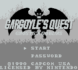
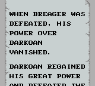

这款游戏是卡普空加入GB阵营的第一款作品，手感跟便秘的魔界村根本一点儿都不像。倒是跟洛克人（元祖）1-3的感觉非常像，关卡的设计也是同样，估计是一个team做的。早期描述卡普空的招牌角色也有蓝色和深红之说，蓝色是洛克人，深红就是指本作品的主人公FireBrand了。可搞笑的是，本作美版的封面，画了一只绿色的石像鬼。石像鬼就是西方用来装饰高处和排水口的小玩意儿，跟龙九子里的螭吻/螭首异曲同工，如果不喜欢石像鬼这个译名，它还另有个高大上的名字：夜行神龙。
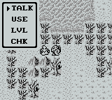
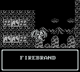

魔界村外传这个系列也很有意思，一代是GB上的原创，而二代在FC上，至于3代则跑到了SFC上。这种打一枪换个地方的开发模式，不多见。
卡婊在GB上只出了二十几款游戏，尤其是194X、威虎战机类的飞机游戏和最拿手的清版过关游戏都没有移植到GB上，简直对不起“婊”字。玩本作的时候略窥到了一点端倪——GB的机能实在太渣了，在这款魔界村外传里，打boss的时候活动块稍微多一点，屏幕就开始缺帧乱闪，晃得人头晕。估计内部评估后觉得动作游戏在GB上混不下去吧……也就洛克人世界和[希魔复活](https://pewae.com/2006/05/bionic-commando.html)GB版能拿得出手。
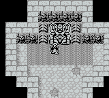
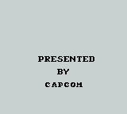

从画面上看，GB早期的开发者也没吃透分层机能，用色太重，整体感觉脏兮兮的。
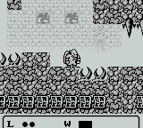

虽然不像魔界村那么如鲠在喉的难，但总体说来石像鬼仍旧很难。主人公主要动作就两个：爬墙和空中滑行。爬墙的动作很猥琐，几乎跟忍者龙剑传的动作一个模子扒出来的，所以小时候还觉得这游戏也是脱裤魔出的；空中滑行在游戏的大部分时间里距离有限。关卡卡人也就在这两点上作文章。难度方面最恶心的就是跟洛克人一样有太多一碰就死的地形，血格基本就是摆设。当年好不容易打过了第一个场景，小过场的桥无论如何也飞不过去，找遍了周围高手也没人能过去，就放弃了玩下去的念头。这次重温特意上gamefaqs查了攻略，才发现自己被这种带着RPG要素的ACT里的RPG小把戏给坑了——需要到村外的一棵树下面调查，获得飞行能力的提升才可以。话说要是当年有互联网和gamefaqs这样的英文攻略站，以我对游戏的钻研精神，高考时英语成绩怎么也能再加20分吧！
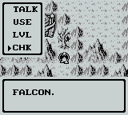

其实我应该庆幸当年的浅尝辄止。本作的难度，中间稍好，最后一关简直令人发指，到处都是随时会跳死的尖刺。最最变态的是最后的boss，攻击力不怎么样，非常耐打也就罢了，关键是对要点的防护太严密了，围着转好几圈都打不中一次。在即时存档这种作弊神器的帮助下，我花了50分钟才把它弄死。换实机的话不说手法如何，电池都难以为继啊！
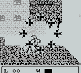

通关后是把boss们又拉出来展览一遍。俗。
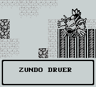
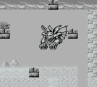
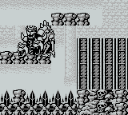
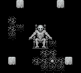
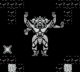