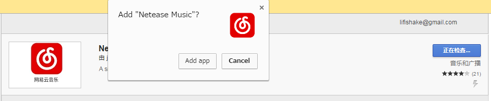

周记No.568

周五开工，上上下下都在讨论一件大事：我们集团被人收购了，从外资独资变成了国有企业控股的某集团的孙子公司。
尤其是新来的小伙伴们，很是憧憬了一下未来——就算没有内部股期权什么的，有航空公司背景的爷爷集团也能整个机票打折什么的吧？
我当即表示他们想多了。
“我在这家公司13年，它改了五次名字，当过民企也当过国企，上过市也退过市，也跟人合并过。你们看我发财了吗？”
众人做扫兴状。
再补一刀：“据说那家航空公司只有空嫂没有空姐。（这句是我瞎编的）。”

自从上次清查软件之后，我就把网易云给卸载了。可编码时不听点玩意儿总觉得别扭。
但咱又不是不守规矩的人。
灵光一闪，想起上次wunderlist在chrome应用里找到了。一搜，果然网易云也存在。
可网易云的chrome应用做得太敷衍了，根本就是网页版，于是装回了久违的豆瓣。
自从豆瓣fm单方面撕毁Windows应用那天起，我就没听过了。
旧梦重圆，涛声依旧。
其实一直觉得豆瓣私人频道的算法逼格比网易的高，就是歌的范围狭隘了点。

又为闺女的周边服务发了次火。这回是托管班。
在托管班订了晚饭才知道，老师竟然鼓励孩子们快吃饭，每天前三名吃完饭的孩子有积分，每个月累计积分给小奖励。
我让臭宝不去争这个前三，她还对小奖励念念不忘。
果断跟她说，只要你一次前三都不得，老师给你什么奖励，爸爸给你双份。
指着你赚钱的收费机构的好处就是，提了意见，他们就把这混蛋积分制度取消了。

@shakira.lu（http://shakiralu.com） 反映说邮件回复不好用了，连忙把代码找出来检查，没查出毛病。
倒是想起@灰狼（itlu.net） 曾经点名批评过邮件回复的格式不好看，索性稍微做了一丢丢修改，凭直觉调了一下宽度。没测在手机上的显示效果。反正我既不用手机登录邮箱，也不看自己留言产生的回复（其实每一封都做了BCC）。
犹豫了一下是否要借此机会把免安装的本地调试环境用twamp建起来，深思之后还是放弃了。最近组里忙，某两人天天加班，别人在debug的时候自己在一边画页面实在太不尊重人了。等twentyseventeen出来再做决定罢。