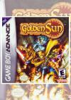
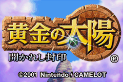
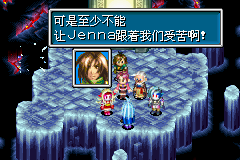
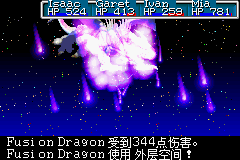
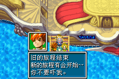
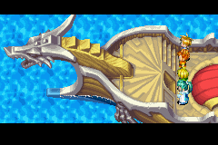
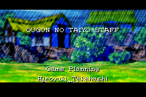
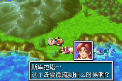
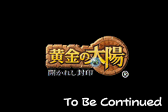

[黄金太阳：失落的时代](https://pewae.com/gaan/aHR0cHM6Ly93d3cuZG91YmFuLmNvbS9nYW1lLzEwNzQxMTU2Lw==)

原名：Golden Sun机种：GBA厂商：Camelot / 任天堂类别：A-RPG发行年月：2001-08耗时：25

GBA篇也打算由一部没碰过的大作开启。
跟SFC不同，GBA虽然也同样没有真机，但这玩意儿出来没几天就有模拟器了，而且那时候正值大学，有大把时间用来花差花差。更兼我的死党3P没到02年就买了一部，拿来玩玩还是很容易的。事实上03年我出差就拿着玩了三个月。所以，GBA上的名作，尤其是中早期的，我没少玩。
选这部的原因，一是因为它名声太响——GBA首发游戏之一，光明系列的团队花了大量时间开发；二是因为当时这个游戏第一时间并不能模拟，后来汉化也几经波折，颇有些小怨念。大学期间就有个想法，模拟成功了一定要打穿。结果这一等就是小20年。

真正玩上以后就很失望。只是一部中规中矩的RPG而已。谜题过于简单，单调的剧情把时间变得冗长，职业系统也没什么特色。据说当初的亮点是画面？？这种构图对于GBA的机能来说，太过于黯淡了吧。
没特色啊！《仙剑》我再怎么看不上眼，还有“飞龙探云手”这么个小亮点呢。

最恶心的是没做完。据说当时开发团队做了一半发现GBA卡带装不下，所以就拆成两部发售了。
玩的时候打迷宫，学到最后一个特技，攻略上说要跳出去上某某岛上过隐藏迷宫的最后一部分。我心说不能把迷宫打完再出去嘛……
谁知道迷宫打完就第一部终结了，根本不给机会。

原打算打通了1以后一鼓作气拿下2的。
但是现在我根本不想碰这个系列的续作。
写这个系列十多年来头一糟觉得浪费了时间。