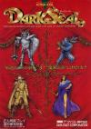

[暗黑封印](https://pewae.com/gaan/aHR0cHM6Ly93d3cuZG91YmFuLmNvbS9nYW1lLzI2MzMwNzkwLw==)

原名：Dark Seal别名：Gate of Doom机种：ARC厂商：DATA EAST类别：A-RPG发行年月：1990-01耗时：7

思来想去，知新篇还是用个街机游戏开始。街机是我们这一代人的情怀，虽然我并不喜欢街机游戏紧张的氛围，而且街厅饱含了被混子们抢钱的悲伤血泪，但当年还是非常喜欢在一旁看别人拼死拼活的同时满嘴跑火车瞎支招的。
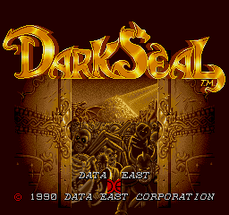

《黑暗封印》大概是第二代的街厅游戏，跟著名的街霸2同时代。后来的机厅往往外厅一半CAPCOM一半SNK，里屋一屋子电子基盘天开眼，这游戏就少见了。
当年看别人玩了无数次，但自己从来没上过手——因为我觉得以自己的水平，一关都过不去。
之所以用这个游戏开头，是想起了当年的一个段子：
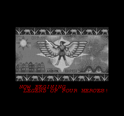

那是1992年的一个周六，半天。放学以后，我跟好朋友[马莲花](https://pewae.com/2010/12/my-friend-lotus-ma.html)以及同班同学小玲一块儿在厅里混着。小玲打动作类和格斗类游戏很厉害，玩这个游戏差不多是当时常混这个游戏厅里最厉害的，一个币能打到第三关的关底BOSS。那天小玲运气不错，把BOSS的血打到一半才挂掉。马莲花不知抽了什么风，非要跟小玲见个高下，买了5块钱的币（20个），誓要打通关。
币全扔进去，只打到第四关中BOSS。于是被小玲一顿嘲笑，说他是“币爷”。为了给马莲花撑面子，我使出了天赋技能大忽悠术：
“你那么厉害，不是也没见到关底吗？上次我在XXX看到一个大哥，三个币打到了关底，又用两个币打通关了。你们知道关底是什么吗？是一只海豹！因为这个游戏名字的就是‘黑暗海豹’！”
看着马莲花和小玲两个学渣一脸卧槽的样子，好爽。
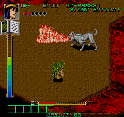

我当然并没有真的见过有人能把这个游戏打很远。
作为老派的游戏，难度肯定是有的，但是也没有变态的难。跟大家熟悉的赤色要塞有点儿像，一切都要套公式一般，靠背版子提前走位。但是四个角色中的三个移动都很慢，容错率太低，而敌人的攻击力又很强，但凡一步走错，想板回来就很难了。虽然有两条命，每条命3滴血，可一次打两滴血的小怪比比皆是，更不要说直接死命的地形杀和BOSS大招了。也许处女座会喜欢这个游戏吧……
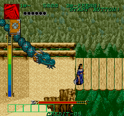

游戏的出品方是当年的街机大佬DATA EAST。故事本身就很俗烂了，某个国家的倒霉公主又被抓走了，国王委托勇士们去把人弄回来……
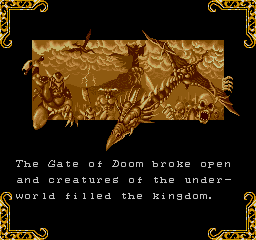
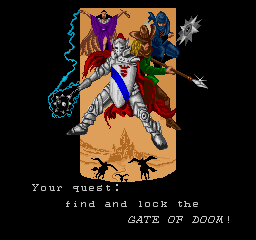
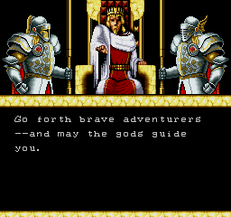
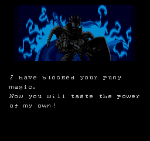

勇士一共四枚。
圣骑士使的是流星锤，收招的时候锤子会绕着身体转一圈，所以在人多的地方不怕打。当初为了省钱保命，是使用率最高的人物。后来有高手指出圣骑是最不好用的，就因为收招太慢，不利于跑。
女巫是火力最猛的。
吟游诗人拿了把叉子，攻击范围最小，特点是不会中毒，在厅里我就没见过有人选叉子。
最后一个是鬼子做游戏最喜欢乱入的忍者，跑得最快，攻击力最弱。看了个录像，高手竟然说忍者才是最好用的角色，就是因为他速度快容错率高。
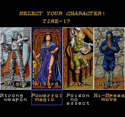

咱用模拟器玩又不差币，选什么忍者，当然是有女的选女的了！
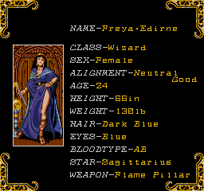
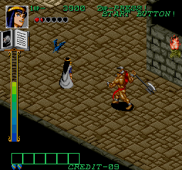

游戏的一大特色是能放魔法。魔法一共14种，攒满能量槽，在魔法书翻到想放魔法的页的时候，按第二个键就可以了（别问我什么是第二个键）。这些魔法有的攻击力强，有的擅长群攻，有的适合逃跑，同一关内用一个少一个，确实能给攻关提供很大的助力。因为游戏的设定，对中BOSS可以用魔法，对大BOSS不能用，所以一般攒到满挑个合适的时机放了就行，攒到关底就浪费了。
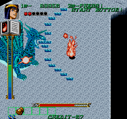
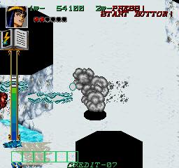
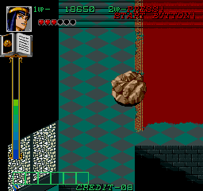

魔法里最有趣的是“？”魔法。可能是对半开的概率吧，运气好玩家会变成一只箱子，不停地往外喷宝物，吃到宝物之后实力就会大大增强；运气不好会受到诅咒变成一只猪，没有攻击力只能躲到魔法失效，庆幸的是变成猪之后跑得很快。
我们几个当时有个切口：“跑得比猪还快。”就是出自小玲一次变猪之后的淡定：“没事儿，变猪跑得快。”
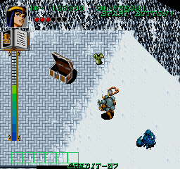
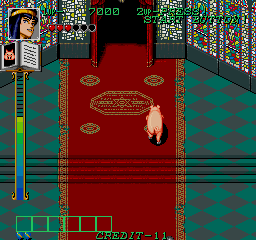

说起来，要不是后来上初二的时候小玲弄丢了我25本《画王》，他就还是我的好朋友小玲，而不是我的同班同学小玲了。
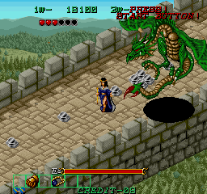

好几种提升实力的道具，什么护手项链护甲之类的，最有用的是靴子，能大大提升打BOSS时的体验。所以小玲这个大高手一般会在一关里用两次魔法，第一次随意，第二次一定要找个没人的地方变箱子吃鞋。一旦变了猪，他就大概率过不了关。
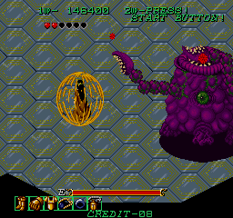
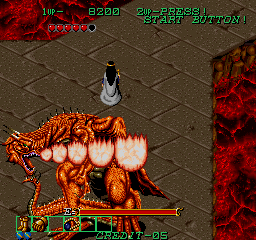

当时最远能看到的第三关BOSS。
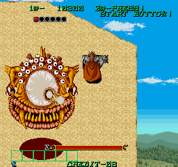

某种程度上说，第四关BOSS比总BOSS还难打，因为一不小心就会被他变成猪，失去输出。而这个游戏耽误时间也是会即死的，哪怕是BOSS战也不例外。
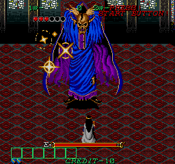

最终BOSS，倒没有多难，会一个旋风斩大招。就是血太长而且攻击力变态，太考验耐性和控制力，一个没跑好，两毛五就没了。
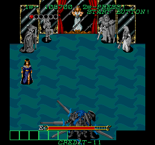
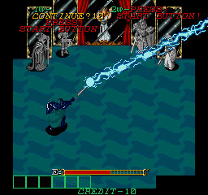

通关画面：
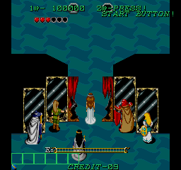
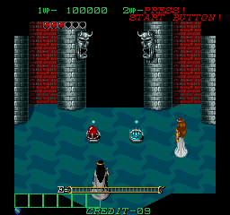
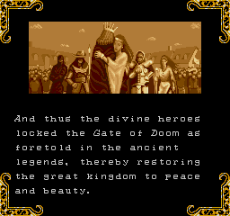
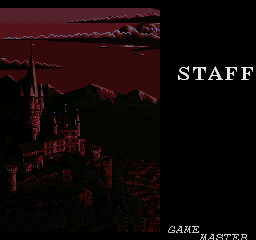
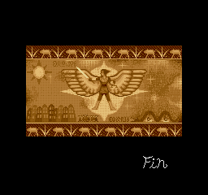

话说后来有个社会大哥真花了10来块钱把通关画面填出来了，打出STAFF的时候那位大哥也大吃一惊：“这就结束了？！上次说有海豹的小B崽子哪去了？海豹呢？”
我趁人多溜了。不是怕大哥，而是怕小玲和马莲花揍我。

@谢，你看我都开始写街机游戏了，就别潜水了呗？这游戏你肯定玩过的。