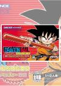

[龙珠大冒险](https://pewae.com/gaan/aHR0cHM6Ly93d3cuZG91YmFuLmNvbS9nYW1lLzIzMDc5MjIy)

原名：ドラゴンボール アドバンスアドベンチャー /Dragon Ball: Advance Adventure机种：GBA厂商：BANPRESTO类别：ACT发行年月：2004-11耗时：48

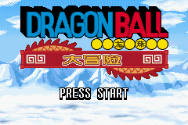

不久前鸟山明先生去世，便决定找个龙珠游戏来缅怀一下他和自己。不少up主也怀了同样的心思，很多怀念视频中便出现了这个游戏。我最喜欢龙珠从与布尔玛的相遇到战胜短笛大魔王之间的剧情。就这么愉快地决定了，这次的缅怀鸟老先生的攻略对象就是它。
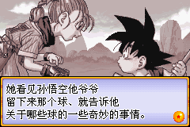

此游戏出品于2004年冬，是GBA中后期[[1]](https://pewae.com/2024/05/dragon-ball-advance-adventure.html#inner_anchor_1)颇有名气的作品。我对GBA的态度并没有太过积极，只会对真正感兴趣的游戏才会尝试一下。《龙珠大冒险》这种动作+格斗游戏，当时明显不在此列。当年错过了也并不后悔，甚至连遗憾都没有。
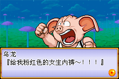

龙珠的游戏大多以RPG和格斗游戏为主，动作的玩法实在凤毛麟角。上手之后觉得诚意满满，小悟空的腆肚子跑、发波时被反冲到后方的头发、空中飞踢，棍子变长、旋转棒子挡子弹，格斗版面的连击抵消和空中追打，差不多都可以在原著里找到一样的帧，真的是久违的回忆。
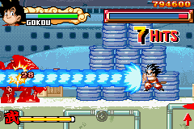
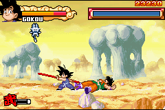

正常游戏中，除了动作版面，还穿插了几个飞行版面和小游戏。并且有二十一、二十二两届武道会的格斗剧情，加上BOSS战的动作面板一对一，玩法可算相当丰富。
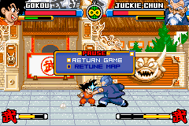

龙珠IP当然在万代和眼镜厂手里。眼镜厂的动作游戏我玩的不多，本作难度对我这个动作游戏苦手来说比较适中，在稍微厉害一点的动作玩家眼里可能算比较容易的。空中的鸟类有些讨厌，而地面敌人大多还好。皮拉夫城和马斯尔塔的地形有些烦人。
对于龙珠迷来说，最大的亮点是终于原著。像什么地狱使者、骷髅机器人这样只出场一两话的小角色都有亮相，把犄角旮旯里的记忆都掏了出来。
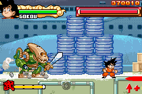
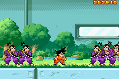
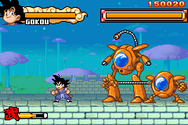

对我来说，遗憾的是人造人8号没有出场，以及弥次郎兵卫只出现在过场动画里。老八跟小悟空从来没动过手，倒也能理解。但是弥次郎兵卫可是跟小悟空打过两页的，设计个用刀的角色不比重复短胳膊短腿的小悟空、小林、孙悟饭、饺子、那木……这一票可操作角色带感得多吗？
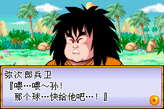

接下来说说缺点。
上篇《卡比弹珠台》的时候，石樱灯笼就~~留言~~预言说：“感觉掌机就应该多出一些比较杀时间，操作逻辑简单的游戏，结果到了GBA时代，很多游戏搞得像是准备给掌机做计划报废一样，搓键搓得手指头疼。”
我这个游戏简直是照他这句话找的！
那个年头很多GBA游戏生怕留不住玩家，拼了老命地增加收藏要素。而我又偏偏是个吃这套的人。
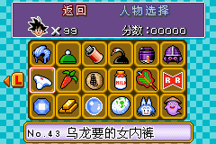

为了最终能够操纵短笛大魔王，需要先通关悟空剧情模式，再通关小林剧情模式，再再打附加模式，在各种犄角旮旯找齐7颗龙珠，再再再刷小兵RUSH模式，随机出现大魔王卡，最后回到标题画面输入秘技（日版），才能选用大魔王打附加模式。
短笛大魔王还不是最后一张卡，最后还藏了个机器桃白白。
于是乎刚玩的时候满腔热忱，越玩评价越低。
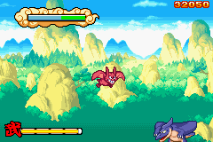

辛辛苦苦刷出来的大魔王并不怎么好用，主要是连击手感不爽。实际上我刷齐了所有人物卡片挨个试了一遍[[2]](https://pewae.com/2024/05/dragon-ball-advance-adventure.html#inner_anchor_2)，真正好用的角色屈指可数。就只有蓝将军比较对胃口。
浪费不少时间不说，还把手柄的方向键给摁坏了。
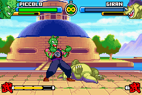

剧情模式最后一个BOSS当然是短笛大魔王，还是颇有些难度的，主要是对招的时候难破防。
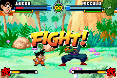

剧情模式的通关画面没什么特色。
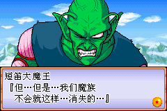
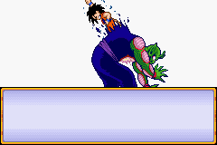
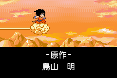

倒是小游戏通关的时候还恭喜你一下下。

---

- [(1)](https://pewae.com/2024/05/dragon-ball-advance-adventure.html#inner_ref_1)：本作日版发售后3天，任天堂的下一代掌机NDS在北美上市
- [(2)](https://pewae.com/2024/05/dragon-ball-advance-adventure.html#inner_ref_2)：本作两个流行的汉化版都有大问题。一个D商汉化版不能正常存档，另一个汉化版切换到饺子开始的中间几个人物后会死机。