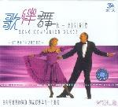

当阿杜略带沙哑、充满颗粒感的嗓音缓缓流出，《他一定很爱你》便将那份躲在车底、眼睁睁看着爱人离去的无奈与心碎刻画得淋漓尽致。这首发行于2002年的华语情歌，以极具辨识度的悲情唱腔和极富画面感的歌词，迅速席卷大街小巷，成为一个时代的伤情记忆。它没有激烈的控诉，只有对自我退出的深沉哀叹，那份“我应该在车底，不应该在车里”的痛楚与卑微，时至今日依然能轻易击中无数都市夜归人的软肋。

点击查看深度鉴赏详情

### 创作背景与情感内核
《他一定很爱你》由李志清作词作曲，收录在阿杜的首张个人专辑《天黑》中。当时的阿杜以建筑工人的身份被发掘，其独一无二的“沙哑原生态”嗓音为这首凄苦的情歌注入了最真实的灵魂。歌曲讲述了一个男人准备给女友送花制造惊喜时，却意外目睹女友与其他男人亲昵的场景。这种极具戏剧冲突的“第三者视角”，将人在爱情破灭瞬间的无措与逃避表现得深入骨髓。

### 乐理剖析与演唱特色
编曲采用了较为传统的流行情歌走向，以木吉他和缓慢的钢琴扫弦作为主基调，营造出一种深夜独行的落寞感。阿杜在演唱时的气声运用与沙哑音色的结合是此曲的最大亮点，每一次副歌部分的撕裂感，都像是一次心弦的拉扯。尤其是那句“我应该在车底”，以一种极度压抑又濒临崩溃的语调唱出，完美展现了男人在面临背叛时的那种自尊心受挫与深深的无力感。

### 时代共鸣与持久影响力
这首歌不仅确立了阿杜“苦情歌王”的地位，更因为其副歌中过于经典的“车底”梗，在网络时代被不断解构和重新演绎，保持了长久的生命力。它精准地捕捉了爱情中“被剩下”的那一方的卑微心理，将私人情感的痛楚放缩成了广泛的社会共鸣。

他一定很爱你 歌词

我躲在车里 手握着香槟
想要给你 生日的惊喜
你越走越近 有两个声音
我措手不及 只得楞在那里

我应该在车底 不应该在车里
看到你们有多甜蜜
这样一来 我也比较容易死心
给我离开 的勇气

他一定很爱你 也把我比下去
分手也只用了一分钟而已
他一定很爱你 比我会讨好你
不会像我这样孩子气
为难着你

我躲在车里 手握着香槟
想要给你 生日的惊喜
你越走越近 有两个声音
我措手不及 只得楞在那里

我应该在车底 不应该在车里
看到你们有多甜蜜
这样一来 我也比较容易死心
给我离开 的勇气

他一定很爱你 也把我比下去
分手也只用了一分钟而已
他一定很爱你 比我会讨好你
不会像我这样孩子气
为难着你

他一定很爱你 也把我比下去
分手也只用了一分钟而已
他一定很爱你 比我会讨好你
不会像我这样孩子气
为难着你

